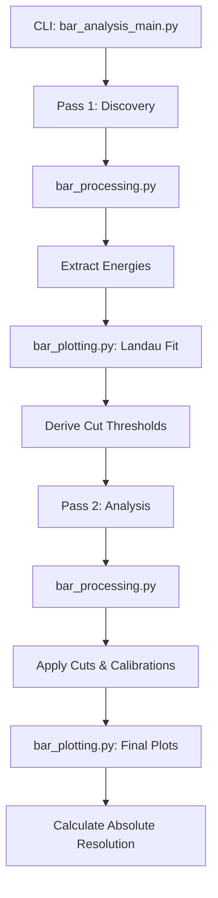

# System Architecture: Modular Bar Analysis

This document describes the organization and data flow of the modular timing analysis suite. 

## Module Organization

The system is decomposed into four functional layers to improve maintainability and reuse.

### 1. Orchestration Layer (`bar_analysis_main.py`)
- **Responsibility**: Handle CLI arguments, resolve file globs, and manage the execution flow.
- **Logic**: Implements a **two-pass strategy**.
    - **Pass 1**: Extracts raw energy spectra to identify the "Most Probable Value" (MPV) using Landau fits. It sets the energy cut windows automatically.
    - **Pass 2**: Applies these cuts, performs final extraction, and generates the calibrated timing plots and resolution calculations.
- **Concurrency**: Manages the `ProcessPoolExecutor` for parallel file processing.

### 2. Processing Layer (`bar_processing.py`)
- **Functions**: `process_file`, `process_file_fast`.
- **Responsibility**: Open ROOT files, build MCP event maps, and extract jagged arrays.
- **Optimization**: `process_file_fast` uses vectorized chunks to minimize Python overhead, making it significantly faster for large datasets.
- **Filtering**: Implements strict channel coincidence, energy cuts, and MCP matching.

### 3. Visualisation Layer (`bar_plotting.py`)
- **Functions**: `plot_t_diff`, `plot_energy`, `plot_phi_vs_energy`, etc.
- **Responsibility**: Generate all PNG outputs and perform mathematical fits.
- **Fitting Engine**:
    - **Gaussian**: Used for $T_L - T_R$ and calibrated phase differences.
    - **Landau (Moyal)**: Used for energy spectra to derive cuts.
    - **Polynomial**: Used in 2D phase-vs-energy plots to model time-walk.

### 4. Utility Layer (`bar_helpers.py`)
- **Responsibility**: Shared "leaf" functions.
- **Contents**:
    - `log()`: Standardized console logging.
    - `find_data_tree()`: Robustly identifies the data tree cycle in ROOT files.
    - `gauss()`: The mathematical model for Gaussian fits.
    - `make_output_dict()`: Ensures both processing functions use the exact same data structure for aggregation.

## Data Flow Diagram

## Maintenance Notes
To add a new plot or a new calculation:
1. Add the key to the accumulator dict in `bar_helpers.make_output_dict`.
2. Update the extraction logic in `bar_processing`.
3. Add a plotting function in `bar_plotting`.
4. Call the new plot from the `main()` loop in `bar_analysis_main`.
